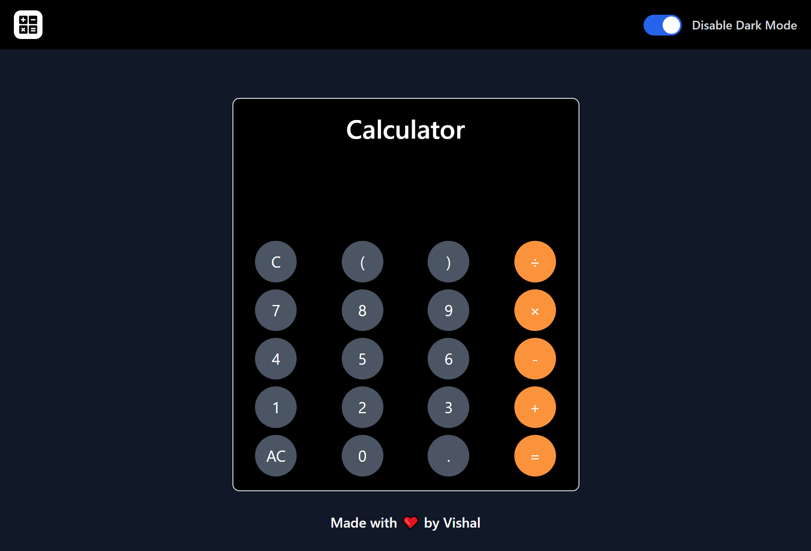
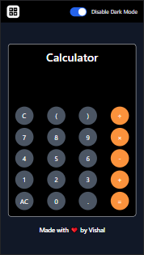

#   React Calculator
### [Project link]("https://arithmatic-calculator.netlify.app")

This is a simple calculator app which performs simple arithmetic operations such as addition, subtraction, multiplication and division. It is made with using React (a JavaScript library) and Tailwind CSS.

 

## 📌 PC Screenshot

## 📌 Mobile Screenshot

 

## 📌 What I Learn

    👉 Learn about Functional Component in ReactJS.
    👉 Learn about Tailwind CSS.
    👉 Learn about PostCSS in Tailwind CSS.

 

## I am new in ReactJS and TailwindCSS so, that's why I took 20 hours to complete this project and I really enjoyed it 😊.

 

## 💬 Connect With Me

- **LinkedIn** - https://www.linkedin.com/in/vishal-kumar-909758228/
- **Instagram** - https://www.instagram.com/_vishal.kumar07/

 

## 📌 Acknowledgments

- Course Instructor - [Hitesh Choudhary](https://github.com/hiteshchoudhary)