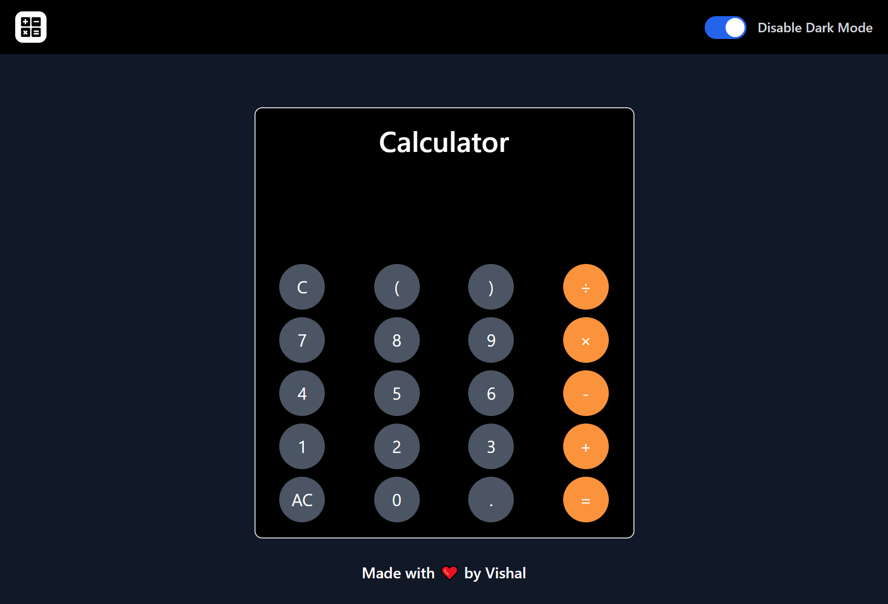
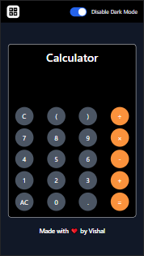

#   Simple Calculator
### [Project Live Link](https://arithematicalculator.netlify.app/)

This is a simple calculator app that performs simple arithmetic operations such as addition, subtraction, multiplication, and division. It is made with using React (a JavaScript library) and Tailwind CSS.

## 📌 PC Screenshot

## 📌 Mobile Screenshot

 

## 📌 What I Learn?

    👉 Learned about Tailwind CSS.
    👉 Learned about Tailwind CSS.
    👉 Learned about PostCSS in Tailwind CSS.
    👉 Learned about Functional components in ReactJS.
    👉 Learned how to render Functional components in ReactJS.
    👉 Learned about the useState hook in ReactJS.
    👉 Learned why the eval function is dangerous in ReactJS.

 

## I am new in ReactJS and TailwindCSS so, that's why I took 20 hours to complete this project and I really enjoyed it 😊.

 

## 💬 Connect With Me

- **LinkedIn** - https://www.linkedin.com/in/vishal-kumar-909758228/
- **Instagram** - https://www.instagram.com/_vishal.kumar07/
